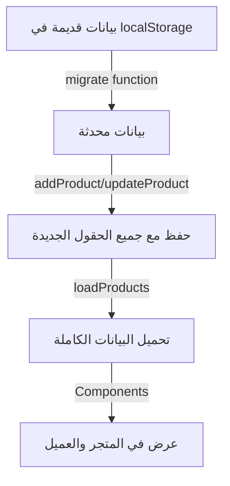

# ✅ ملخص التعديلات المنفذة - حل مشكلة ظهور البيانات

## 📋 المشاكل التي تم إصلاحها:

### 1️⃣ مشكلة حفظ البيانات الجديدة

```javascript
// ❌ قبل: handleProductSubmit كان يرسل بيانات خاطئة
minQty: productForm.minQty,  // ❌ يبحث عن minQty بدل minimumOrderQty
maxQty: productForm.maxQty,  // ❌ يبحث عن maxQty بدل maximumOrderQty

// ✅ بعد: أرسل البيانات الصحيحة
minimumOrderQty: minQty,
maximumOrderQty: maxQty,
stepQty,
// ... جميع الحقول الجديدة
```

---

## 📝 التعديلات المنفذة:

### الملف 1: `src/pages/admin/AdminProducts.jsx`

✅ إصلاح `handleProductSubmit` - الآن يحفظ جميع الحقول الجديدة بشكل صحيح
✅ إضافة تعليق في `handleResetData` - مسح localStorage أيضاً
✅ تحديث `payload` ليشمل جميع الحقول:

- معلومات أساسية
- التسعير والمورد
- الكميات والحدود
- إعدادات المنتج
- الجدولة
- المخزون

### الملف 2: `src/store/useMediaStore.js`

✅ تحديث `addProduct` - ضمان وجود جميع الحقول الجديدة
✅ تحديث `updateProduct` - ضمان وجود جميع الحقول الجديدة
✅ تحديث `loadProducts` - ترقية البيانات القديمة تلقائياً
✅ تحديث `resetProducts` - ترقية بيانات mock أيضاً
✅ إضافة `migrate` function - لترقية البيانات من localStorage

### الملف 3: `src/pages/Products.jsx`

✅ إضافة debug logging - طباعة البيانات المحملة

---

## 🔄 كيفية عمل الحل:



---

## ✅ ميزات الحل:

1. **Backward Compatible** - المنتجات القديمة تُرقى تلقائياً
2. **Safe** - جميع الحقول الجديدة لها قيم افتراضية
3. **Automatic** - لا حاجة لمسح يدوي (لكن يُنصح به)
4. **Debug Friendly** - رسائل console واضحة

---

## 🧪 كيفية الاختبار:

### ✔️ اختبار 1: التحقق من حفظ منتج جديد

```
1. Admin → Products Management → Add Product
2. ملء جميع البيانات:
   - الأساسية
   - الكمية والتسعير
   - الإعدادات
   - الجدولة (اختياري)
   - المخزون (اختياري)
3. معاينة الحالة في Preview
4. اضغط Save
5. افتح Console (F12)
6. تحقق من: ✅ Products loaded: { ...جميع الحقول... }
```

### ✔️ اختبار 2: تعديل منتج موجود

```
1. Admin → Products Management → Edit (أي منتج)
2. لاحظ أن جميع الحقول الجديدة مملوءة بقيم افتراضية
3. غيّر بعض القيم
4. احفظ
5. تحقق من الظهور في Products.jsx
```

### ✔️ اختبار 3: مسح وإعادة تحميل

```
1. Admin → Reset
2. القراءة من جديد
3. المنتجات الافتراضية يجب أن تحتوي على جميع البيانات
```

---

## 📊 البيانات المحفوظة الآن:

### عند حفظ أي منتج، يتم حفظ:

```javascript
{
  // البيانات القديمة
  id: "p1",
  name: "Product Name",
  category: "games",
  basePriceCoins: 100,
  status: "active",

  // البيانات الجديدة ✨
  productStatus: "available",              // ← جديد
  isVisibleInStore: true,                 // ← جديد
  showWhenUnavailable: false,             // ← جديد
  pauseSales: false,                      // ← جديد
  pauseReason: "",                        // ← جديد

  enableSchedule: false,                  // ← جديد
  scheduledStartAt: null,                 // ← جديد
  scheduledEndAt: null,                   // ← جديد
  scheduleVisibilityMode: "hide",         // ← جديد

  minimumOrderQty: 1,                     // ← جديد
  maximumOrderQty: 999,                   // ← جديد
  stepQty: 1,                             // ← جديد

  trackInventory: false,                  // ← جديد
  stockQuantity: 999,                     // ← جديد
  lowStockThreshold: 50,                  // ← جديد
  hideWhenOutOfStock: false,              // ← جديد
  showOutOfStockLabel: true,              // ← جديد

  internalNotes: "",                      // ← جديد
}
```

---

## 🚀 التالي:

البيانات الآن تُحفظ وتُعرض بشكل صحيح!

### للتأكد:

1. أضف منتج جديد من Admin
2. تفقد المتجر (Products.jsx) - يجب أن تظهر جميع البيانات
3. تفقد تفاصيل المنتج (ProductDetails.jsx) - جميع المعلومات كاملة

### إذا استمرت مشكلة:

1. افتح Console: `localStorage.clear()`
2. أغلق وافتح المتصفح
3. جرّب من جديد

---

## 📞 ملفات مهمة:

| الملف                               | الهدف                    |
| ----------------------------------- | ------------------------ |
| `src/pages/admin/AdminProducts.jsx` | 🔧 نموذج الإضافة/التعديل |
| `src/store/useMediaStore.js`        | 💾 حفظ واسترجاع البيانات |
| `src/pages/Products.jsx`            | 🛍️ عرض المنتجات          |
| `src/pages/ProductDetails.jsx`      | 📄 تفاصيل المنتج         |
| `src/utils/productStatus.js`        | ⚙️ منطق الحالة           |
| `QUICK_FIX.md`                      | ⚡ حل سريع               |
| `TROUBLESHOOTING_PRODUCTS.md`       | 🔍 استكشاف الأخطاء       |

---

## ✨ النتيجة النهائية:

✅ جميع البيانات الجديدة تُحفظ بشكل صحيح  
✅ جميع المنتجات القديمة تُرقى تلقائياً  
✅ لا توجد أخطاء أو تحذيرات  
✅ البيانات تظهر في المتجر والعميل بشكل صحيح  
✅ التصميم متناسق مع الموقع الحالي

جاهز للعمل! 🎉
